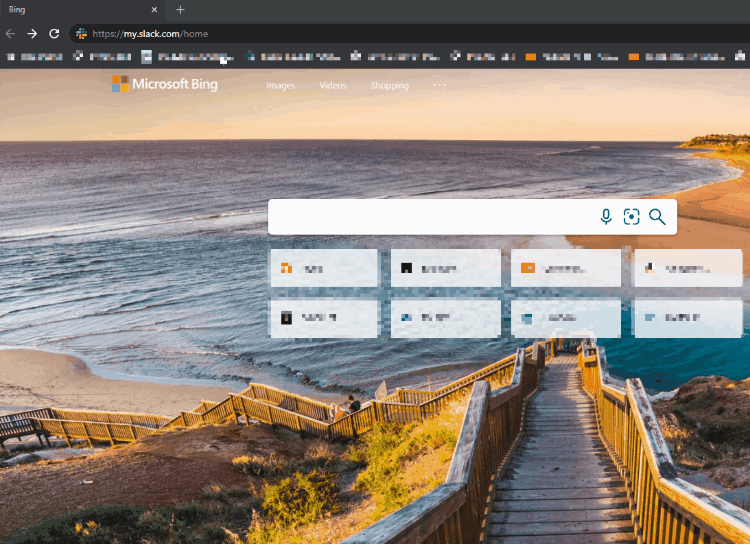

# sync-ldap-to-slack

Slack has a bunch of fancy connectors to sync various enterprise groups to default channels, but enterprises often tightly control that functionality and then us mere users are left trying to manage group channels by hand.

 That sucks. Enter `sync-ldap-to-slack` a somewhat easy way to sync an LDAP group (Active Directory etc) to a Slack channel!

 ## Usage

 ```
usage: sync-ldap-to-slack.py [-h] -t TOKEN (-i CHANNEL_ID | -c CHANNEL) -u LDAP_URL -b LDAP_BASE [-a LDAP_ATTRIBUTE]
                             -g GROUP [--remove] [--remove-only] [--dryrun] [-d]

Sync a Slack channel's membership to an LDAP group

optional arguments:
  -h, --help            show this help message and exit
  -t TOKEN, --token TOKEN
                        Slack access token
  -i CHANNEL_ID, --channel-id CHANNEL_ID
                        Channel ID (not name!)
  -c CHANNEL, --channel CHANNEL
                        Channel name
  -u LDAP_URL, --ldap-url LDAP_URL
                        URL of your LDAP endpoint. usually LDAP://...
  -b LDAP_BASE, --ldap-base LDAP_BASE
                        Search base for finding the LDAP group. For example, ou=groups,o=awesome.co
  -a LDAP_ATTRIBUTE, --ldap-attribute LDAP_ATTRIBUTE
                        attribute to retrieve during LDAP queries. This should be the list of users within a group
                        that will be used to sync with Slack
  -g GROUP, --group GROUP
                        LDAP group to query for
  --remove              remove members not in group (default is to just add)
  --remove-only         Don't add missing users, rather only remove users that are not in the group from the channel.
                        Useful for controlling access to a channel without forcing people to be a member.
  --dryrun              don't actually make any changes
  -d, --debug           largely unhelpful spew
  ```

## Examples

1. `python sync-ldap-to-slack.py -u ldap://ldap.example.com -b ou=groups,o=example.com -t xoxs-... -g awesome-sauce -c cool-channel`
  
    a. `-u`: LDAP URL to interact with  
    b. `-b`: LDAP requires a search base, this is it  
    c. `-t`: Use token `xoxs-` for authentication ([Get a token](#Getting-a-Slack-Token))  
    d. `-g`: LDAP group name to sync users from
    e. `-c`: Slack channel to sync to

1. `python sync-ldap-to-slack.py -u ldap://ldap.example.com -b ou=groups,o=example.com -t xoxs-... -g awesome-sauce -c cool-channel --remove`
    
    Same as above, but adds `--remove` which allows the script to also kick users who are in the channel but not in the group

## Getting a Slack Token

### **`🚨 WARNING 🚨`**

This script uses an `xoxs-` token which represents you on Slack. **NEVER** share this with anyone. EVER.

1. Go to https://my.slack.com/home and log in if needed
2. Ensure that you are in a workspace (if you're at the workspace selection screen, select the workspace that you are going to run this script against)
3. Copy `window.prompt("your api token is: ", TS.boot_data.api_token)`
4. In your browser type `javascript:` in the URL bar
5. Paste `window.prompt("your api token is: ", TS.boot_data.api_token)` & press enter

The token should now be presented to you in a dialog that you can copy from.



## Installation

*tested on Windows and Fedora*

No fancy packaging at this point:

1. Grab [sync-ldap-to-slack.py](https://raw.githubusercontent.com/nachmore/sync-ldap-to-slack/main/sync-ldap-to-slack.py)
2. Install any dependencies:
   1. `pip install slack_sdk`
   1. `pip install python-ldap`
      1. If you get `fatal error: Python.h: No such file or directory`
         1.  (Fedora etc) `sudo yum install python3-devel`
         2.  (Ubuntu etc) `sudo apt-get install python3-dev`
      2. If you get `fatal error: lber.h: No such file or directory`
         1. (Fedora etc) `sudo yum install openldap-devel`
         2. (Ubunte etc) `sudo apt-get install libsasl2-dev libldap2-dev libssl-dev`
      3. (Windows) You may need to install some [prerequisites](https://www.python-ldap.org/en/python-ldap-3.3.0/installing.html#build-prerequisites), in particular `OpenLDAP` (optional items not required)
   2. `pip install requests`
